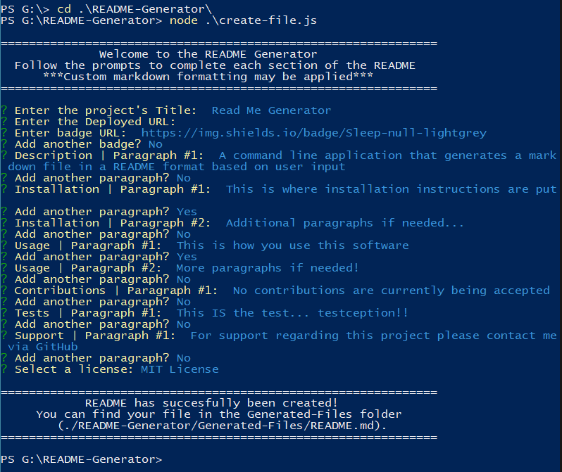
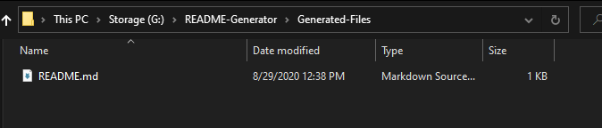

# Read Me Generator

  

## Description

A command line application that generates a mark down file in a README format based on user input

## Table of Contents

* [Installation](#installation)
* [Usage](#usage)
* [Contributing](#contributing)
* [Tests](#tests)
* [Support](#support)
* [License](#license)

## Installation

*Requires Node.js to run*
Download and save the README-Generator folder in your favorite directory.

## Usage

Using your preferred console, navigate to the program's root folder (./README-Generator/). Execute the create-file.js using node ``node .\create-file.js`` to run the program. Follow the in console prompts to fill in each field of the README. Additional mark down formatting may be used in the input fields as needed for a more customized document. [This Video](https://drive.google.com/file/d/1acU2CHdCoOnyn1I0MJrUBS4jIMHxfPYP/view) demonstrates the use of the program through powershell.

The generated file is saved in (./README-Generator/Generated-Files/README.md) and is overwritten each time the program is run.

## Contributing

No contributions are currently being accepted for this project.

## Tests

This IS the test... testception!!

This README file was created using this generator. 

## Support

For support regarding this project please contact me via GitHub

## License

This project is licensed under the MIT License.